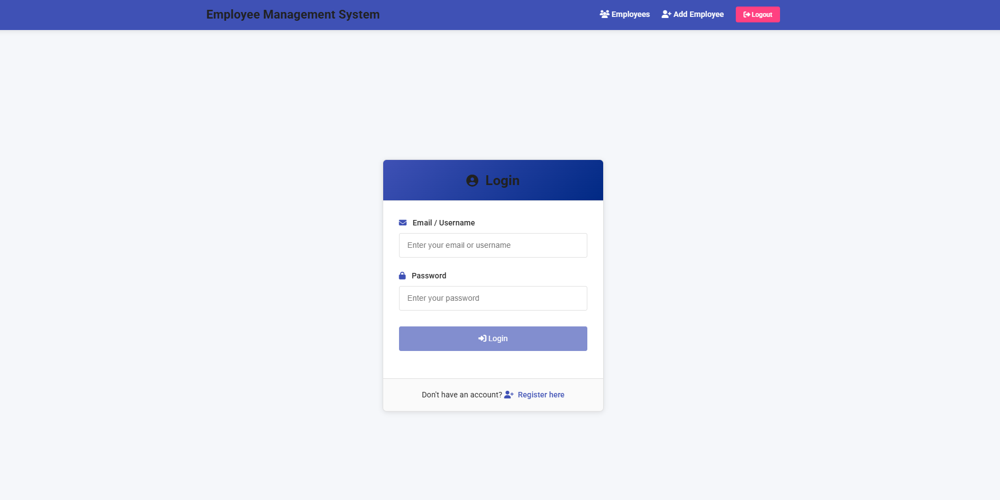
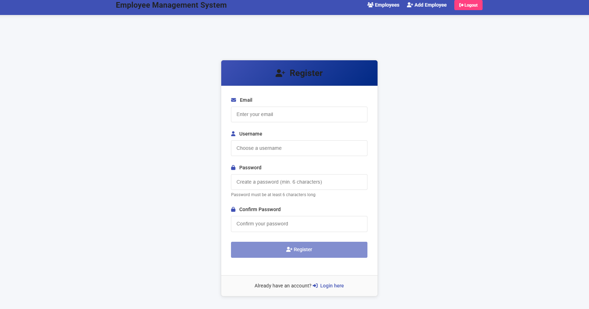

### 📌 **Employee Management System**
A GraphQL-based backend application for managing employees, built using **Node.js**, **Express**, **GraphQL**, **MongoDB**, and **Apollo Server**.

---

## 🚀 **Technologies Used**
### Backend:
- **Node.js** – JavaScript runtime for backend development.
- **Express.js** – Web framework for Node.js.
- **GraphQL** – API query language used for flexible data retrieval.
- **Apollo Server** – GraphQL implementation for Express.
- **MongoDB Atlas** – NoSQL database for storing user and employee data.
- **Mongoose** – ODM (Object Data Modeling) for MongoDB.

### Security:
- **bcryptjs** – Password hashing for secure storage.
- **jsonwebtoken (JWT)** – User authentication and authorization.

### Development Tools:
- **dotenv** – Manages environment variables securely.
- **Postman** – API testing.
- **Git & GitHub** – Version control.

---

## 📚 **Project Overview**
The **Employee Management System** provides a GraphQL API for managing employee records, allowing users to:
- **Sign up** and **log in** securely.
- **Add, update, delete, and retrieve employee records**.
- **Search employees** by ID, designation, or department.
- **Use JWT authentication** to protect sensitive operations.

---

## 🛠 **Setup Instructions**
### 1️⃣ Clone the Repository
```sh
git clone https://github.com/utsav-1730/101476134_comp3133_assignment2.git
cd COMP3133_101476134_Assignment1
checkout main
```

### 2️⃣ Install Dependencies
```sh
npm install
```

### 3️⃣ Configure Environment Variables
Create a **.env** file in the project root and add:
```env
PORT=8081
MONGODB_URI=mongodb+srv://<username>:<password>@cluster0.mongodb.net/comp3133_StudentID_assignment1?retryWrites=true&w=majority
JWT_SECRET=your_secret_key
```

### 4️⃣ Start the Server
```sh
node index.js
```
or for development:
```sh
nodemon index.js
```

---

## 🔥 **GraphQL API Endpoints**
The API is accessible at:
```
http://localhost:8081/graphql
```
It provides the following **Queries** and **Mutations**:

### 🔹 Queries:
```graphql
# Login Query
query {
  login(usernameOrEmail: "testuser@example.com", password: "password") {
    token
    user {
      id
      username
      email
    }
  }
}

# Get All Employees
query {
  getAllEmployees {
    id
    first_name
    last_name
    email
    designation
    salary
    department
  }
}

# Search Employee by ID
query {
  searchEmployeeById(id: "EMPLOYEE_ID_HERE") {
    id
    first_name
    last_name
    email
    gender
    designation
    salary
    date_of_joining
    department
    employee_photo
  }
}

# Search Employee by Designation or Department
query {
  searchEmployeeByDesignationOrDepartment(
    designation: "Software Engineer"
    department: "IT"
  ) {
    id
    first_name
    last_name
    designation
    department
  }
}
```

### 🔹 Mutations:
```graphql
# Signup Mutation
mutation {
  signup(
    username: "testuser",
    email: "testuser@example.com",
    password: "securepassword"
  ) {
    id
    username
    email
    created_at
  }
}

# Add Employee
mutation {
  addEmployee(
    first_name: "John"
    last_name: "Doe"
    email: "johndoe@example.com"
    gender: "Male"
    designation: "Software Engineer"
    salary: 5000
    date_of_joining: "2025-02-01"
    department: "IT"
    employee_photo: "profile1.jpg"
  ) {
    id
    first_name
    last_name
    email
    designation
    salary
    department
  }
}

# Update Employee
mutation {
  updateEmployee(
    id: "EMPLOYEE_ID_HERE"
    first_name: "Jane"
    last_name: "Smith"
    email: "janesmith@example.com"
    designation: "Senior Developer"
    salary: 6000
    department: "Engineering"
  ) {
    id
    first_name
    last_name
    email
    designation
    salary
    department
  }
}

# Delete Employee
mutation {
  deleteEmployee(id: "EMPLOYEE_ID_HERE") {
    id
    first_name
    last_name
  }
}
```

---

## 🧪 **Testing the API**
1. Open **Postman** or **GraphiQL**.
2. Test queries and mutations using GraphQL playground.
3. Authenticate using JWT and include it in API requests for protected operations.

---

## 📁 **Project Structure**
```
/src
  ├── config/        # Database connection
  ├── models/        # Mongoose models (User, Employee)
  ├── resolvers/     # GraphQL resolver functions
  ├── schema/        # GraphQL schema definitions
  ├── middleware/    # Authentication middleware (JWT)
index.js             # Entry point
.env                 # Environment variables
README.md            # Project documentation
```

---

## 👉 **GitHub Repository**
[GitHub Link](https://github.com/utsav-1730/101476134_comp3133_assignment2.git)

---

## 📄 **Sample User Credentials**
```json
{
  "username": "Utsav",
  "email": "utsav@example.com",
  "password": "Test@123"
}
```

## 📸 **Application Screenshots**

### Login Screen


### Registration Screen


### Employee List/Information


### Add Employee Form


### Employee Details


### Delete Employee Confirmation


## 👨 **Author**
**Utsav Changani**  
**COMP3133 - Full Stack Development II**
